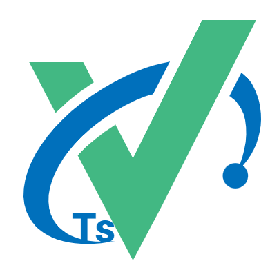
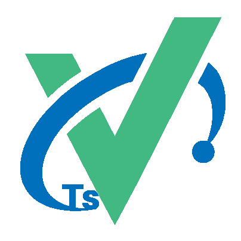

<div align="center">
<<<<<<< HEAD
	
=======
	
>>>>>>> main
	<p align="center">
	    <a href="https://v3.vuejs.org/" target="_blank">
	        
	    </a>
	    <a href="https://element-plus.gitee.io/#/zh-CN/component/changelog" target="_blank">
	        
	    </a>
		<a href="https://www.tslang.cn/" target="_blank">
	        
	    </a>
		<a href="https://vitejs.dev/" target="_blank">
		    
		</a>
		<a href="#" target="_blank">
		    
		</a>
	</p>
	<p>&nbsp;</p>
</div>

- QQ交流群：475555266，有问题群里反馈，可及时解决
# Vue3与TSX内测版
WIP: Vue3(TSX) + Vite + TypeScript + Element-Plus + Pinia + Axios

CSS方面会考虑换成Emotion,因为模板自带的样式隔离无法在TSX中使用所以只能使用css-in-js方案
### 修改入口文件
因为默认项目模板是以`src/main.js`为入口的，我们需要把它修改为`src/main.ts`。  
在`根目录的index.html`中修改入口文件的引用即可：
```html
... ...
<body>
  ... ...
  <script type="module" src="/src/main.ts"></script>
</body>
</html>

```

### 优化TS类型推断
在src目录下，创建`shim.d.ts、source.d.ts`  

`shim.d.ts`: (这个其实不太需要，因为项目中全是通过tsx开发的)
```ts
declare module '*.vue' {
  import Vue from 'vue';
  export default Vue;
}
```
`source.d.ts`: (优化编译器提示，声明静态资源文件)
```ts
declare const React: string;
declare module '*.json';
declare module '*.png';
declare module '*.jpg';
```

### 集成vue-router
```bash
yarn add --dev vue-router@4.0.4

```
这里可以去`npm官网`查找最新版本  
在src目录下，`新建router文件夹`，并在文件夹内`创建index.ts`
`index.ts`:
```javascript
import { RouteRecordRaw, createRouter, createWebHistory } from 'vue-router';

const routes: RouteRecordRaw[] = [
  {
    path: '/',
    name: 'Home',
    component: () => import('../views/Home'),
  },
  {
    path: '/about',
    name: 'About',
    component: () => import('../views/About'),
  },
];

const router = createRouter({
  history: createWebHistory(),
  routes,
});

export default router;

```  
这里创建router的方式与之前不同，在vue3中，结合TS的类型推断，开发效率会高很多。  

### 集成 pinia

### TSX
最终我们的组件代码，都会是这样的：`App.tsx`:  
```javascript
import { defineComponent } from 'vue';
import {RouterLink, RouterView} from 'vue-router';
import './style/main.scss'

export default defineComponent({
  name: 'App',
  setup() {
    return () => (
      <>
        <div id="nav">
          <RouterLink to="/">Home</RouterLink> |
          <RouterLink to="/about">About</RouterLink>
        </div>
        <RouterView/>
      </>
    );
  }
});
```  

#### git 提交规范

一、参考 vue 规范 (Angular)

- feat 增加新功能
- fix 修复问题/BUG
- style 代码风格相关无影响运行结果的
- perf 优化/性能提升
- refactor 重构
- revert 撤销修改
- test 测试相关
- docs 文档/注释
- chore 依赖更新/脚手架配置修改等
- workflow 工作流改进
- ci 持续集成
- types 类型定义文件更改
- wip 开发中

二、提交 commit

>git commit -m feat:Add workflow, homepage, etc.

## 结尾
自我感觉TSX比模板好多了，并且html、组件标签的属性都带有类型推断，Vue3与TS的结合是大趋势
